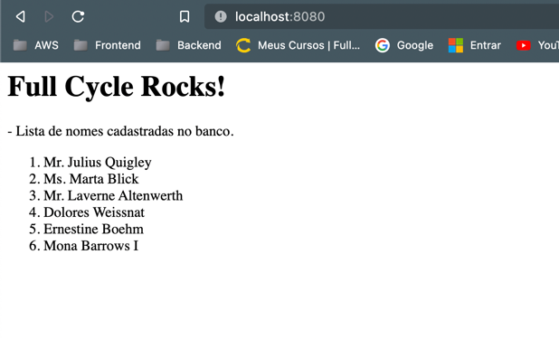

# Desafio NodeJS + Nginx com Docker

## Objetivo
Criar um código em Node.JS que insira em um banco de dados o nome de uma pessoa e retorne a lista de nomes cadastradas.
É necessário utilizar o NGINX como proxy reverso para que a requisição passe pelo mesmo e por sua vez chame o serviço Node.JS

## Docker Compose
```
Execute:

docker-compose up -d
 ```
Acesse http://localhost:8080/ e o retorno deve seguir o exemplo abaixo:

